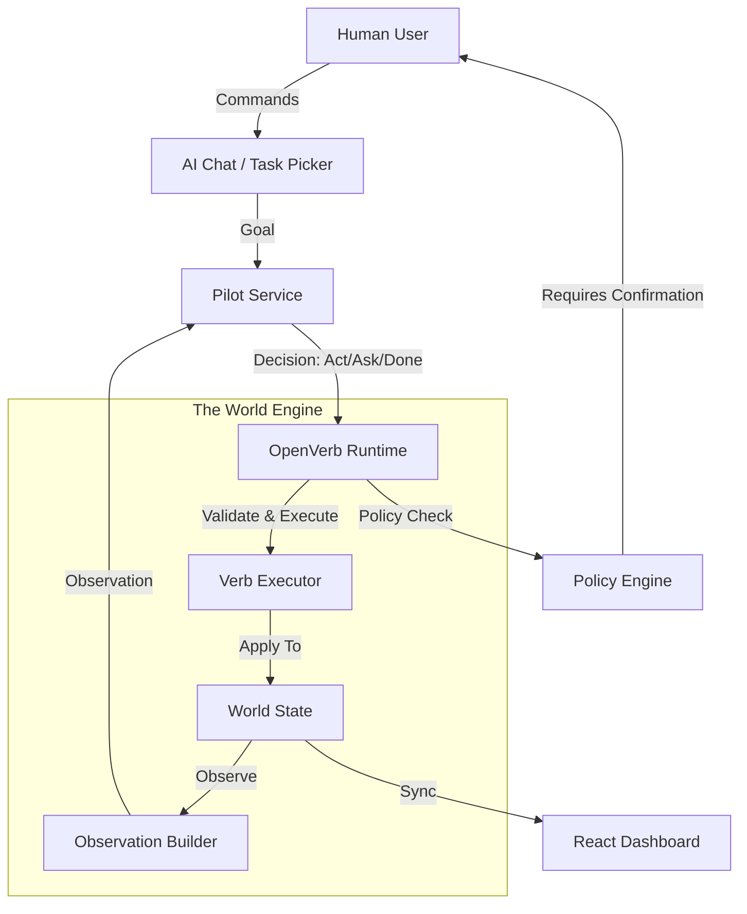

# 🤖 OpenVerb Town
### *The Reference Implementation for the OpenVerb Framework*

[](https://github.com/openverb/openverb-town)
[](https://opensource.org/licenses/MIT)

**OpenVerb Town** is a high-fidelity robot simulation sandbox designed to demonstrate the power of the **OpenVerb Protocol**. It provides a declarative, deterministic environment where AI agents (Pilots) can interact with a structured world using a standardized set of verbs.

---

## 🌟 Overview

OpenVerb is a communication bridge between **Intent** and **Action**. Instead of writing complex, imperative code for every robot movement, developers define **Verbs** (capabilities) and **Observations** (state). The Framework handles the "messy" parts of execution, while the Pilot focuses on "thinking."

### Why OpenVerb?
- **Declarative**: Verbs are defined with Zod-like schemas for parameters and validation.
- **Deterministic**: The world engine ensures that the same action in the same state produces the same outcome.
- **Supervised**: Built-in Policy layers allow humans to confirm, block, or modify AI decisions.
- **Framework-Agnostic**: Works with Large Language Models (LLMs), heuristic scripts, or hybrid pilots.

---

## 🏗️ Architecture

The framework is built on a clean, decoupled architecture:



---

## ⚡ The Verb Protocol

Verbs are the "DNA" of the robot's capabilities. Every verb in OpenVerb Town is formally registered and follows a strict execution flow:

| Verb | Category | Description |
| :--- | :--- | :--- |
| `world.move_to` | Navigation | A* pathfinding to specific coordinates. |
| `world.pick` | Interaction | Lift items into the robot's inventory. |
| `world.place` | Interaction | Deposit items into containers or on surfaces. |
| `world.toggle` | Interaction | Control lights, faucets, and switches. |
| `world.observe` | Perception | Active scan of the environment. |
| `world.clean` | Interaction | Remove dirt or spills. |

---

## 🧠 AI Piloting

OpenVerb Town supports two primary piloting modes:

1.  **AI Pilot (GPT-4/o-mini)**: Uses advanced reasoning to decompose natural language goals (e.g., "Clean the kitchen") into sequences of verbs.
2.  **Heuristic Pilot**: A rule-based baseline that demonstrates autonomous reasoning for standard household tasks (Trash, Packages, Night Routines).

---

## 🚀 Getting Started

### Prerequisites
- Node.js 18+
- OpenAI API Key (for AI Pilot features)

### Installation
```bash
# Clone the repository
git clone https://github.com/sgthancel/OpenVerb-Robot-Actions.git
cd OpenVerb-Robot-Actions
npm install

# Run the development server
npm run dev
```

---

## 📚 Documentation

- [**OpenVerb Specification**](file:///c:/Users/cplha/openverb-town/docs/OPENVERB_SPEC.md) - Deep dive into schemas, types, and the executor.
- [**Pilot Development**](file:///c:/Users/cplha/openverb-town/docs/PILOTS.md) - How to build your own agent logic.
- [**World Building**](file:///c:/Users/cplha/openverb-town/docs/WORLD.md) - Creating new rooms, entities, and scenarios.

---

## ⚖️ License
Distributed under the MIT License. See `LICENSE` for more information.

---
*Built with ❤️ by the OpenVerb Community.*
